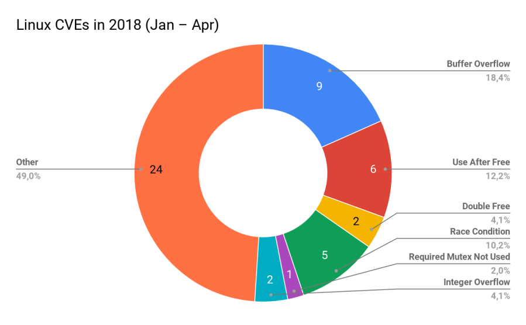

Linguagens modernas: só "uma nova sintaxe"?
===========================================

_Por Tiz_

> **[Pequeno preâmbulo]**
>
> Eu havia começado a escrever este texto em Agosto/2019, porém _coisas
> acontecem_ e desde lá não tive tempo - ou melhor, não tive coragem de
> reservar tempo, afinal muita coisa tem acontecido desde então - para
> continuá-lo, voltando só em Novembro/2019. Sendo assim, boa parte do teor
> dele muda drasticamente a partir de certo ponto, visto que o que me inspirou
> a escrevê-lo em Agosto não é mais o mesmo que me inspirou a voltar em
> Novembro.
>
> Isso mostra que ter uma regularidade na escrita é algo bastante essencial,
> então me cobrarei a manter uma regularidade melhor.

Por algum motivo, em vez de admirar os avanços que se obtém em linguagens
modernas, algumas pessoas na área de tecnologia acabam olhando para a novidade
como uma perda de tempo, uma mera "brincadeira de novato". Programadores Python
e JavaScript chegam a ser chamados pejorativamente de "moderninhos" por algumas
dessas pessoas, que reforçam que suas linguagens de costume são mais
compensadoras, seja pela fama, pela performance, porque "dá pra fazer as mesmas
coisas nela", ou simplesmente por não verem a necessidade na novidade.

Até onde essas pessoas tem razão? Linguagens modernas, sejam as
_garbage-collected_ e/ou com omissão de tipos, são para brincar, sobrando as
linguagens _mainstream_ de tipagem estática com aritmética de ponteiros, bem
consolidadas a partir dos anos 80 e 90, e por aí vai, como representantes de
linguagens para softwares de verdade?

Ou melhor: o que estamos negando aos tais softwares de verdade ao tratá-las
dessa forma?

Primeiras gerações de linguagens de programação
-----------------------------------------------

> **[Observação]**
>
> Primeiramente, não só pela história de linguagens de programação ser
> **longa** e bem complexa, mas também pelo fato de que outros tipos de
> linguagem não são relevantes para este tópico, quando falarmos "linguagens de
> programação" **estaremos nos referindo apenas às de alto-nível**.

Na década de 1940 e início da de 1950 tínhamos alguns protótipos de linguagens,
como **[Plankalkül](https://en.wikipedia.org/wiki/Plankalk%C3%BCl) (1948)**
(que só foi efetivamente implementada em 1998) e **[Short
Code](https://en.wikipedia.org/wiki/Short_Code_(computer_language)) (1952)**.
Como na época não tínhamos compiladores, todo o processo de traduzir o código
em alto-nível para binário/hexadecimal e repassar para um cartão perfurado (que
era basicamente o que alimentava a memória de instruções das máquinas da época)
era completamente manual. Então, se buscava criar linguagens fáceis de seres
humanos fazerem essa tradução - não necessariamente legíveis, porém.

Quando, em 1952, Grace Hopper implementa o primeiro _linker_ (na época ele foi
chamado de "compilador", mas pelos conceitos atuais ele se encaixa como um
_linker_), que traduzia palavras em inglês para código de máquina, aos poucos a
necessidade de facilitar a tradução humana vai diminuindo, especialmente depois
da criação de **[Fortran](https://en.wikipedia.org/wiki/Fortran)**, cujo
**rascunho** de sua especificação foi formulado em **1954** e seu primeiro
compilador foi implementado em **1957**. O fato de ser o primeiro compilador
que aplicasse otimizações animou programadores de compiladores da época a
escrever compiladores para Fortran, e assim, com novas ideias e recursos em
novas edições de Fortran, as linguagens de programação foram tomando formas
mais parecidas com as que estamos acostumados hoje, mas isso se falarmos apenas
das imperativas.

Ainda na década de 1950, temos o surgimento das primeiras noções de linguagens
funcionais, como
**[IPL](https://en.wikipedia.org/wiki/Information_Processing_Language)
(1956)**, que introduz conceitos como manipulação de listas e "funções de
primeira-ordem" (a grosso modo, tratar funções da mesma forma que você trata
dados do ponto de vista de o que a linguagem permite fazer), e
**[Lisp](https://en.wikipedia.org/wiki/Lisp_(programming_language)) (1958)**
que, apesar de tudo, [não é
funcional](https://letoverlambda.com/index.cl/guest/chap5.html), mas algumas
características dela tendem a se aproximar desse paradigma. Em **1966** temos
**[APL](https://en.wikipedia.org/wiki/APL_(programming_language))** (de _"A
Programming Language"_, fazendo um trocadilho com "Uma linguagem de
programação"), que começou como simples notações matemáticas para manipulação
de _arrays_.

C, PDP-11 e Ciência da Computação para Compiladores
---------------------------------------------------

A linguagem C surge só em **1972**, com o intuito de criar ferramentas para o
Unix para o PDP-11 (um processador da época) de uma maneira mais fácil, e aqui
que as coisas começam a ficar mais interessantes. As preocupações envolviam
trabalhar na portabilidade do Unix, afinal estamos falando de uma época em que
a recém se podia, aos poucos, **abstrair a máquina alvo** parando de se
importar tanto com Assembly para se ter um programa otimizado, se preocupando
em **tentar reduzir o tempo de compilação**. C conseguia ser simples o
suficiente para se aplicar otimizações e, tendo uma tipagem estática
**fraca¹**, não era exigido muito do compilador para fazer verificações para o
programador quanto ao sistema de tipos.

> _¹: Como há pelo menos 3 definições de "tipagem forte/fraca", deixo claro que
> utilizo "tipagem fraca" no sentido de **coerção** entre tipos, ou seja, C é
> extremamente permissivo com relação a interações entre valores de tipos
> diferentes: em comparações entre `unsigned` e `signed` ocorre uma conversão
> implícita, a operação é permitida e não gera erros de compilação, por
> exemplo._

Poucas preocupações com a qualidade da linguagem, do ponto de vista de
**projeto da linguagem**, tomavam conta de linguagens como C. Outras linguagens
tomavam alguns cuidados extras, seja com foco em didática (como
**[Pascal](https://en.wikipedia.org/wiki/Pascal_(programming_language))
(1970)**) ou com não incluir alguma forma de `goto` por serem extremamente
propensas a erro (vide [crítica feita por
Dijkstra](https://homepages.cwi.nl/~storm/teaching/reader/Dijkstra68.pdf) - um
grande contribuidor da Ciência da Computação).  No mesmo período em que surge
C, porém, temos algumas linguagens que visam explorar conceitos dentro da área
de Computação, em especial no quesito de sistema de tipos, como
**[Smalltalk](https://en.wikipedia.org/wiki/Smalltalk) (1972)** e
**[ML](https://en.wikipedia.org/wiki/ML_(programming_language)) (1973)**, ou em
como é realizada a computação, e quem traz uma forte contribuição nessa
discussão é **[Prolog](https://en.wikipedia.org/wiki/Prolog) (1972)**.

Vejamos o que há de interessante nessas linguagens e por que vale a pena
citá-las aqui:
- **Smalltalk** era uma descrição completa de "o que deveria ser uma linguagem
  orientada a objetos" (da qual Java se distancia **muito** em aspectos
  bastante fundamentais - mas isso é assunto para outro artigo). Nesse sentido,
  já se pensa mais em dar forma a novos paradigmas, **explorar formas de
  descrever programas** abordando conceitos como imutabilidade (que, sim, faz
  parte de Orientação a Objetos), encapsulamento (que não é fazer _getters_ e
  _setters_), _message-passing_ e polimorfismo.
- Enquanto isso, **ML** consegue dar uma cara nova à programação funcional
  introduzindo um **sistema de tipos** robusto bastante interessante. Repare no
  [método de verificação de tipos em
  expressões](https://en.wikipedia.org/wiki/Hindley%E2%80%93Milner_type_system#Type-checking_vs._type-inference):
  compiladores fazem uso de conceitos como decidibilidade em provas de teoremas
  para validar se os tipos estão corretamente definidos **sem que seja
  necessário explicitá-los**. Ou seja, ML traz uma forma inteligente de se
  introduzir **inferência de tipos** (não confunda com tipagem dinâmica!).
- No lado de Prolog, temos uma forma de descrever computação que não se baseia
  em sequências de instruções (como as imperativas) nem em séries de funções em
  um sentido matemático puro, mas sim em **descrever programas como pequenos
  teoremas a serem validados**.

Perceba: até então, boa parte da preocupação dos projetistas de linguagem era
na criação de ferramentas para automatizar alguma tarefa, criar mais
ferramentas, ou facilitar trabalho manual. Tempos depois, finalmente temos
conceitos teóricos sendo fundamentados em linguagens de programação, criando
uma nova geração de pesquisas e objetivos, ou seja: se enaltece que
compiladores e linguagens são **uma peça fundamental da Ciência da
Computação** enquanto um campo de estudo teórico bastante denso, ao mesmo tempo
que se traz, para uma área antes com foco majoritariamente prático, conceitos
definidos há décadas (computabilidade, decidibilidade, _cálculo-lambda_, ...).
Isso tem **sérios impactos** na qualidade dos programas de hoje em dia - e não
estamos falando de qualidade apenas enquanto "um código bonitinho" -, mas já
chegaremos lá.

Python e JavaScript: nem tão novas nem tão modernas
---------------------------------------------------

Continuando a linha do tempo, temos **C++ (1980)** estendendo C para dar
suporte a classes; **Eiffel (1985)** trazendo um sistema de testes totalmente
checável em tempo de compilação (baseado na noção de [_Design by
Contract_](https://en.wikipedia.org/wiki/Design_by_contract)); **Erlang
(1986)** trazendo _pattern matching_ e alguns conceitos de programação
funcional. E então, por mais que comumente se diga que Python e JavaScript são
"linguagens moderninhas", essas linguagens surgem logo na década seguinte:
Python em 1991 e JavaScript em 1995. PHP e Java, que nunca entram nesse
conceito de "moderninhas", surgiram em 1995: o mesmo ano de JavaScript, e 4
anos posterior a Python!

É interessante analisar que boa parte da pejoratividade em chamar essas
linguagens de moderninhas se baseia em questões como:

- São linguagens dinamicamente tipadas;
- Não exigem que tipos sejam explicitados;
- São projetadas pensando em execução por interpretadores;
- Carregam um caráter de simplicidade em relação à sintaxe.

Ou seja, se vê flexibilidade e simplicidade como características modernas e
infantis, porém essa visão é baseada em uma desinformação completa, veja:

- Tipagem dinâmica já era presente em **APL** e **Lisp**, dos anos 1950 e 1960;
- Já se tinham interpretadores para essas mesmas duas linguagens;
- APL e Lisp não possuiam um mecanismo para se explicitar tipos;
- Um interpretador completo de Lisp pode ser feito em menos [1000 linhas de
  código C](https://github.com/rui314/minilisp), ou seja, já tínhamos
  linguagens bastante simples e minimalistas há quase 40 anos.

Então se há algo que se pode criticar programadores Python e JavaScript em
termos de modernidade é justamente acreditar que estão utilizando _features_
modernas quando elas já existem desde a metade do século passado. Nem mesmo
_list-comprehensions_ de
**[Haskell](https://en.wikipedia.org/wiki/Haskell_(programming_language))
(1990)** são uma grande novidade, já que
**[SETL](https://en.wikipedia.org/wiki/SETL) (1969)** já trazia essa _feature_.

É claro, Python e JavaScript não são um exemplo de performance, mas isso não
necessariamente é um problema: o ganho com produtividade costuma compensar,
especialmente em _softwares_ cujo gargalo não seja processamento pesado (de que
adianta otimizar tanto um programa que passa quase o tempo todo transferindo e
recebendo dados pela rede ou disco?). E quando for o gargalo, isso só significa
que uma linguagem dinâmica demais como Python não é adequada, mas nesse quesito
temos linguagens realmente modernas mais adequadas, conforme será comentado
mais à frente.


A questão é que várias dessas _features_ não eram tão exploradas em linguagens
_mainstream_ porque computadores antigamente não eram tão poderosos: se já era
demorado compilar e otimizar um programa em C em uma máquina com alguns poucos
MBs de memória disponível, imagine realizar intensas validações durante esse
processo, a um custo de possíveis GBs de uso de memória? Porém muito se tem
avançado em pesquisa na área de compiladores, o que tem permitido avanços
significativos no poder de inferência de linguagens bastante antigas como C++,
e esses mesmos avanços acabam impactando no surgimento de melhores formas de
descrever programas sem adicionar custos em tempo de execução (ou seja, sem
piorar a performance ou aumentar o uso de memória).

Linguagens modernas, modernização das linguagens: uma questão de segurança
--------------------------------------------------------------------------

Se formos ser justos e realmente pensar na modernidade de linguagens, devemos
considerar algumas ideias de projeto que visam **segurança**, um bom sistema de
_build_ e expressividade. **[Rust](https://www.rust-lang.org/) (2010)** e
**[Swift](https://swift.org/) (2014)** conseguem trazer facilidade de se
escrever até mesmo código paralelo com garantias de que todas as operações
sejam _memory-safe_ e - especificamente no caso de Rust - _thread-safe_. Ser
_memory-safe_ significa que o compilador garante que o código escrito pelo
programador está livre de acessos inválidos à memória (é mínima a possibilidade
de ocorrer um _segfault_ - um erro de acesso inválido à memória bastante comum
e muitas vezes difícil de identificar/tratar), enquanto ser _thread-safe_
significa que o compilador garante que não hajam erros relacionados a múltiplos
processadores acessando um mesmo dado concorrentemente.

E por mais que exista um certo ego de programadores que acreditam veemente que
esses problemas só existem para programadores novatos/ruins, vale lembrar de
uma afirmação muito bem colocada [neste
artigo](https://medium.com/@sgrif/no-the-problem-isnt-bad-coders-ed4347810270):

>_"Nobody is arguing that if we just had better drivers on the road we wouldn’t
>need seatbelts. We should not be making that argument about software
>developers and programming languages either."_
>
>**(Tradução Livre)** "Ninguém fala que se nós tivéssemos motoristas melhores
>não precisaríamos de cintos-de-segurança. E também não deveríamos usar esse
>argumento quanto a desenvolvedores de software e linguagens de programação."

Por mais que certos programadores insistam que a culpa é de programadores ruins
que "não entendem C ou C++ de verdade", que digam que "são profissionais
experientes e estão seguros de que não cometem esses erros", [um programador
bastante competente com mais de 25 anos de experiência pode contestar essas
afirmações](https://robert.ocallahan.org/2017/07/confession-of-cc-programmer.html).
Podemos mapear isso tomando como  exemplo um software com controle de qualidade
e restrições para aceitar alterações de código bastante fortes: **o kernel
Linux**. Se analisarmos a lista de CVE (_Common Vulnerabilities and Exposures_,
que justamente lista vulnerabilidades comuns), veremos o seguinte gráfico
([fonte](https://phil-opp.github.io/talk-konstanz-may-2018/#14)):



Não há como negar que os desenvolvedores e avaliadores da base de código do
kernel Linux são experientes: estamos falando inclusive de pessoas como Linus
Torvalds, afinal. E mesmo com isso, vulnerabilidades relacionadas a
_memory-safety_ continuam passando. Mesmo com checagens, analisadores
estáticos, _valgrind_ ou o que for. E não há como meramente culpar
programadores: em alguns casos, como C++, há tanta complexidade envolvida que
**Scott Meyers**, o autor de _"Effective C++"_ e _"Effective Modern C++"_,
[parou de atualizar seus livros para corrigir detalhes
técnicos](http://scottmeyers.blogspot.com/2018/09/the-errata-evaluation-problem.html)
pois apenas dois anos e meio sem usar a linguagem foram o suficiente para não
conseguir lembrar de cabeça certos detalhes essenciais sobre o funcionamento
interno da linguagem.

E mesmo modernizar as linguagens existentes não é o suficiente (leia: [C++
moderno não irá nos
salvar](https://alexgaynor.net/2019/apr/21/modern-c++-wont-save-us/)), pois as
linguagens _mainstream_ mais antigas **não foram projetadas** para lidar com
esses problemas (inclusive, C foi projetada pensando que "o programador sabe o
que está fazendo", o que conforme exposto acima é justamente uma das causas de
vulnerabilidades existentes), ainda que atualizações auxiliem nisso.

Apesar disso, modernizar linguagens é o **mínimo** que devemos fazer, uma vez
que reescrever softwares de décadas de existência inteiros para novas
linguagens é completamente inviável. E, algumas vezes, mudanças que impactam
significativamente vêm fantasiadas de "mudanças estilísticas". Nesse sentido,
para um bom Cientista da Computação que entenda de segurança, especialmente
vivendo em uma época que já passamos por várias situações de invasões via
falhas como _buffer overflow_, **não deveria ser uma discussão se devemos usar
`auto` em C++ ou não**. Aos que não conhecem, `auto` serve para **inferir**
tipos das variáveis em sua declaração, a exemplo:

```cpp
auto x = 0; // x é um `int`
auto y = 0u; // y é um `unsigned int`
auto z = foo(); // `z` é do mesmo tipo de retorno de `foo()`
```

Isso pode parecer algo meramente estilístico à primeira vista, mas perceba: se
a declaração de uma variável envolve reconhecer o tipo dela, então é necessário
que seja atribuir um valor (afinal, é desse valor que virá o tipo inferido), e
isso anula a possibilidade de uma das falhas mais simples de segurança de C e
C++: **`auto` impede com 100% de certeza o uso de variáveis não
inicializadas!** Ou seja, é impossível que se tenha:

```cpp
int i;
foo(i); // qual o valor de `i`?
```

Que é justamente algo [destacado pela CVE como
vulnerabilidade](https://cwe.mitre.org/data/definitions/457.html). Se você usa
`auto` e tentar utilizar uma variável não-inicializada, seu programa não
compila, o que é uma vantagem, afinal como diz um provérbio moderno: "o
programa mais seguro é aquele que não compila".

Para onde vão as linguagens modernas
------------------------------------

Boa parte do progresso tem sido em cima de construir um **sistema de tipos**
mais robusto, possivelmente pelo fato de que ele tem se mostrado uma ferramenta
bastante e natural dentro de linguagens para fornecer segurança, capacidade de
performance (afinal, é uma das informações mais impactantes para seu compilador
tomar decisões de quando pode otimizar - inclusive JITs, dependendo do caso), e
ainda enriquecer as formas de descrever seu software.

E há bastante complexidade nisso: um dos desafios mais correntes atualmente é o
de implementar **Tipos Dependentes** em linguagens _mainstream_, que em resumo
são tipos que dependem de valores. Pode ser, por exemplo, um tipo `Array<int,
32>` (ou seja, Array de 32 elementos inteiros), que é diferente de uma variável
do tipo `int[]` que coincidentemente está alocado com 32 elementos (como seria
com linguagens como Java): o **tipo** da variável impõe a restrição de 32
elementos. Isso eliminaria, por exemplo, a necessidade de se comparar se um
acesso a um índice está dentro dos limites do _array_: isso já é descrito pelo
**tipo** da linguagem, e portanto o compilador pode **provar** se esse acesso é
válido ou não.

Para este assunto, tome a liberdade de ler [este artigo sobre tipos
dependentes](https://medium.com/background-thread/the-future-of-programming-is-dependent-types-programming-word-of-the-day-fcd5f2634878)
e veja no que se baseia: indução matemática, conhecimento de sistemas de tipos,
e mais uma penca de conhecimentos teóricos, muitos deles únicos da Ciência da
Computação.

Para finalizar
--------------

Ter auxílio da linguagem e de ferramentas nativas a ela é **essencial** para
que programadores saibam quando as falhas existem. É essencial que
programadores possam se preocupar em **descrever sua solução** em vez de se
perder com detalhes específicos do funcionamento interno de linguagens, e aí é
que entramos no ponto de linguagens modernas: se tem buscado, **dentro de
campos teóricos de Ciência da Computação** (com bom apoio de matemática com
áreas como Teoria de Conjuntos), formas de auxiliar programadores a passar mais
tempo projetando soluções e menos tempo corrigindo _bugs_ que só existem
meramente porque suas linguagens permitem que existam.

Nesse sentido, é justo e necessário que se criem linguagens mais modernas e bem
pensadas, e isso é um **avanço tecnológico** com áreas de pesquisa dedicadas,
não uma brincadeira de criança. Tínhamos certos problemas no passado, eles
foram (em boa parte) resolvidos, e agora devemos seguir em frente, e assim
segue a evolução de linguagens: resolvendo problemas novos, não tendo apego aos
antigos.

Visto também que se diminuem linguagens dinâmicas como Python e JavaScript, que
meramente reusam recursos de décadas anteriores a elas, coloco minha opinião de
que boa parte da resistência à modernidade é meramente questão de costume: veja
a comunidade Java, que sempre criticou tentativas de modernização à linguagem e
rebateu críticas ao excesso de verbosidade dela alegando coisas como "escrever
mais é uma vantagem", porém quando em Java 10 se implementa inferência de tipos
[saem notícias com títulos sobre o quanto essas features são
revolucionárias](https://blog.overops.com/how-java-10-will-change-the-way-you-code/).

Devemos analisar mais as linguagens modernas com bons olhos e olhos de
esperança por formas melhores de descrever nossas soluções do que desmerecer o
trabalho de anos de pesquisa em Computação Teórica. Ponho a mão no fogo em
dizer: linguagens de programação ainda vão mudar muito nos próximos anos.

Leituras extras
---------------

1. [The Future of Programming is Dependent Types — Programming Word of the Day](https://medium.com/background-thread/the-future-of-programming-is-dependent-types-programming-word-of-the-day-fcd5f2634878)
2. [No, the problem isn't "Bad Coders"](https://medium.com/@sgrif/no-the-problem-isnt-bad-coders-ed4347810270) - Sean Griffin, Medium
3. [Microsoft: 70% of all security bugs are memory safety issues](https://www.zdnet.com/article/microsoft-70-percent-of-all-security-bugs-are-memory-safety-issues/) - Catalin Cimpanu, ZDNet
4. [The Internet Has a Huge C/C++ Problem and Developers Don't Want to Deal With It](https://www.vice.com/en_us/article/a3mgxb/the-internet-has-a-huge-cc-problem-and-developers-dont-want-to-deal-with-it) - Alex Gaynor, Vice
5. [Modern C++ won't save us](https://alexgaynor.net/2019/apr/21/modern-c++-wont-save-us/) - Alex Gaynor
6. [CWE-457: Use of Uninitialized Variable](https://cwe.mitre.org/data/definitions/457.html) - CWE
